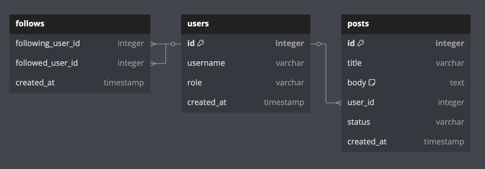
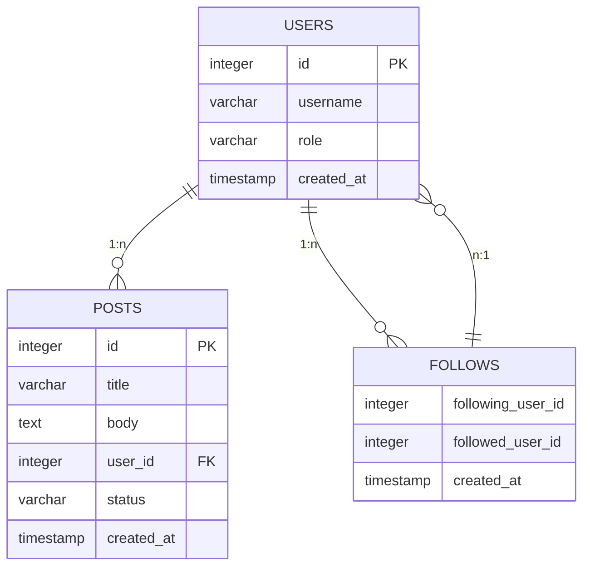

# test_db
## Photo on dbdiagrams

```sql
CREATE TABLE countries (
    country_id INTEGER PRIMARY KEY,
    name VARCHAR(100) NOT NULL
);

```
## Structure db


```mermaid
erDiagram
    USERS {
        integer id PK
        varchar username
        varchar role
        timestamp created_at
    }

    POSTS {
        integer id PK
        varchar title
        text body
        integer user_id FK
        varchar status
        timestamp created_at
    }

    FOLLOWS {
        integer following_user_id
        integer followed_user_id
        timestamp created_at
    }

    USERS ||--o{ POSTS : "1:n"
    USERS ||--o{ FOLLOWS : "1:n"
    FOLLOWS ||--o{ USERS : "n:1"
```
