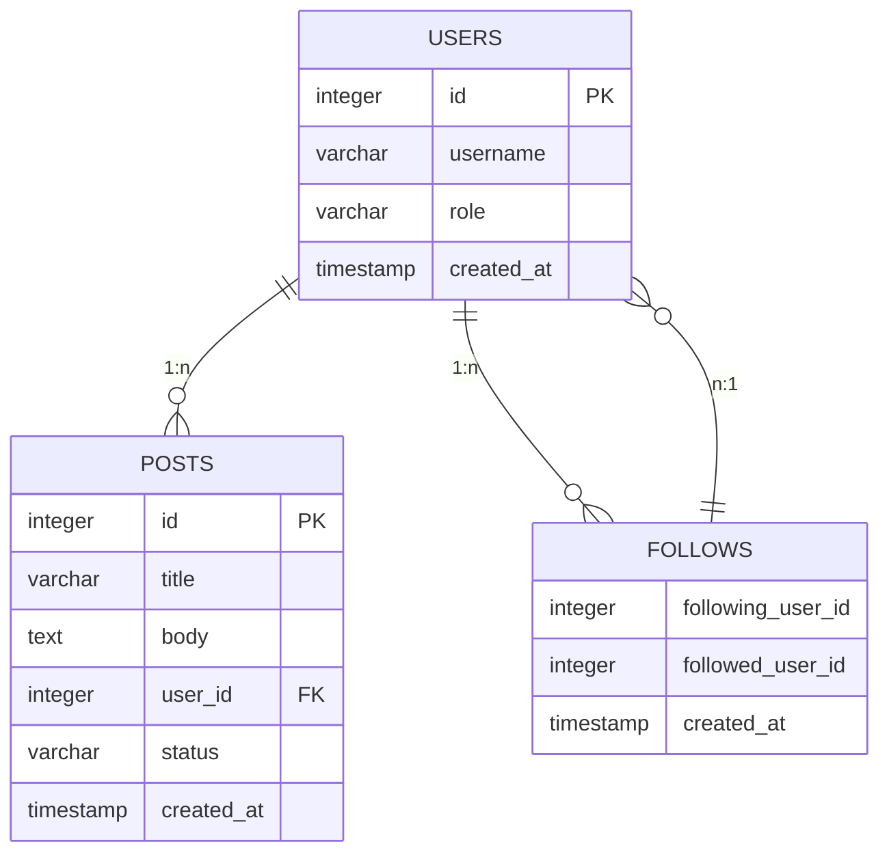

# test_db
## Photo on dbdiagrams

```sql
CREATE TABLE clients (
  client_id INT GENERATED ALWAYS AS IDENTITY PRIMARY KEY,
  first_name VARCHAR(100) NOT NULL,
  last_name VARCHAR(100) NOT NULL,
  email VARCHAR(255) UNIQUE NOT NULL,
  phone VARCHAR(20) UNIQUE NOT NULL,
  registered_at DATE NOT NULL DEFAULT CURRENT_DATE
);

CREATE TABLE agents (
  agent_id INT GENERATED ALWAYS AS IDENTITY PRIMARY KEY,
  first_name VARCHAR(100) NOT NULL,
  last_name VARCHAR(100) NOT NULL,
  email VARCHAR(255) UNIQUE NOT NULL,
  phone VARCHAR(20) UNIQUE NOT NULL,
  registered_at DATE NOT NULL DEFAULT CURRENT_DATE,
  commission_percentage DECIMAL(5,2) NOT NULL CHECK (commission_percentage >= 0 AND commission_percentage <= 100)
);
```
## Structure db


